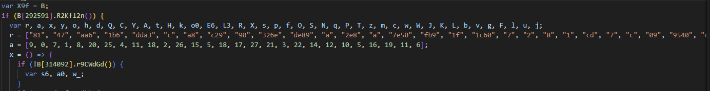

# E1 Player Deobfuscator

This project undoes most of the key transformations done to obfuscate the e1-player used on sites like flixhq & hianime.

It wasnt particularly difficult to reverse although neither was the last WASM based implementation, please provide a better challenge in future :3

---

### (1) The getSources request will return an AES CBC ciphertext

`/embed-1/v2/e-1/getSources?id=<XRAX>`

### (2) Then to decrypt it we just locate the ciphertext array and their indexes


### (3) Combine them based on those aformentioned indexes e.g.
```js
const r = ["81", "47", "aa6", "1b6", "dda3", "c", "a8", "c29", "90", "326e", "de89", "a", "2e8", "a", "7e50", "fb9", "1f", "1c60", "7", "2", "8", "1", "cd", "7", "c", "09", "9540", "c9"];
const a = [9, 0, 7, 1, 8, 20, 25, 4, 11, 18, 2, 26, 15, 5, 18, 17, 27, 21, 3, 22, 14, 12, 10, 5, 16, 19, 11, 6];
a.map(n=>r[n]).join("");
```

### (4) If the key is 64 chars its probably a valid AES key 🎉

---

Author - Ciarán

[Join Discord](https://discord.gg/z2r8e8neQ7)